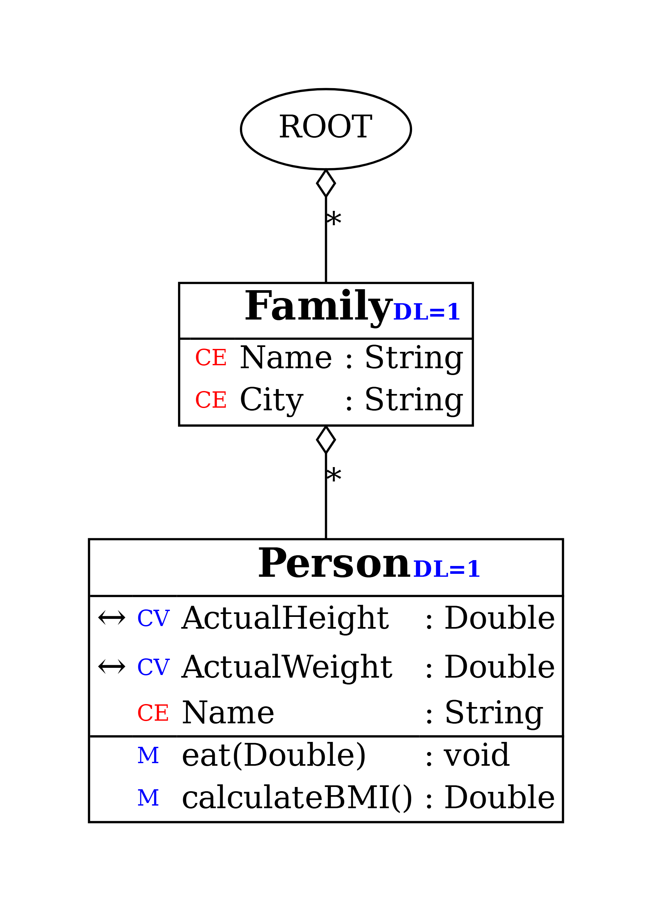

# CERN Quasar Basic Task – Family & Person OPC UA Server

This project was my **second hands-on exercise at CERN** during my summer internship 2025, where I implemented an OPC UA server independently using **C++** and the **Quasar framework**. The project allowed me to apply hierarchical class design, implement cache variables, develop server-side methods, and validate functionality using UaExpert.

The server models a **Family → Person hierarchy**, where each Person object has physical attributes and methods that automatically update dependent variables like BMI.


---

## Project Overview

The objectives of this project were to:

* **Reinforce OPC UA concepts** after completing the introductory project.
* **Design a hierarchical class structure**: `Family` → `Person`.
* **Implement cache variables** for physical attributes (height, weight) with validation logic.
* **Implement methods** (`eat()`, `calculateBMI()`) to modify and compute data on the server.
* **Validate functionality** using UaExpert to subscribe to variables and monitor updates.

---

## Class Hierarchy

The server consists of two main classes:

* **Family** (parent class): Contains multiple Person objects.
* **Person** (child class): Stores physical attributes and exposes methods.

### Person Object Attributes
* **Cache Variables**
  * `ActualHeight` (Double, Read/Write)
  * `ActualWeight` (Double, Read/Write)
  * `TheBMI` (Double, Read-only)
* **Methods**
  * `eat(double amount)`: Increases weight and triggers BMI recalculation.
  * `calculateBMI()`: Computes BMI based on the following formula:
  
$$BMI = \frac{Weight_{kg}}{(Height_{m})^2}$$



---

## Key Implementation Snippets

### 1. Family: Updating Child Person Objects
The Family class iterates through its child Person objects to trigger their internal update cycles.

```cpp
void DFamily::update() {
    for(DPerson* person : persons()) {
        person->update();
    }
}

```

### 2. Person: Validated Cache Variable Updates
The Person class validates inputs (e.g., preventing negative height) and triggers dependent calculations automatically upon a successful write.

```cpp
UaStatus DPerson::writeActualHeight(const OpcUa_Double& v) {
    if(v <= 0 || v > 300){
        return OpcUa_BadInvalidArgument;
    }
    getAddressSpaceLink()->setActualHeight(v, OpcUa_Good);

    OpcUa_Double BMI;
    callCalculateBMI(BMI); // Recalculate BMI immediately after change

    return OpcUa_Good;
}

UaStatus DPerson::writeActualWeight(const OpcUa_Double& v) {
    if(v <= 0){
        return OpcUa_BadInvalidArgument;
    }
    getAddressSpaceLink()->setActualWeight(v, OpcUa_Good);

    OpcUa_Double BMI;
    callCalculateBMI(BMI);

    return OpcUa_Good;
}
```

### 3. Person: BMI Calculation Method
This server-side method pulls the latest cache values and updates the read-only TheBMI variable.

```cpp
UaStatus DPerson::callCalculateBMI(OpcUa_Double& BMI) {
    OpcUa_Double height, weight;
    getAddressSpaceLink()->getActualHeight(height);
    getAddressSpaceLink()->getActualWeight(weight);

    // Height is converted from cm to meters for the calculation
    BMI = weight / std::pow(height * 1e-2, 2);
    getAddressSpaceLink()->setTheBMI(BMI, OpcUa_Good);

    return OpcUa_Good;
}
```

---

## Validation & Testing
The server functionality was validated using **UaExpert**:

- [x] **Data Integrity**: Wrote values to `ActualHeight` and `ActualWeight`; verified the server rejected invalid inputs (e.g., 0 or negative values).
- [x] **Automation**: Observed automatic updates to the read-only variable `TheBMI` whenever height or weight changed.
- [x] **Methods**: Invoked `eat()` method and verified `ActualWeight` and `TheBMI` were updated correctly in real-time.
- [x] **Multi-Instance**: Confirmed that multiple `Person` objects under a `Family` maintained their own unique states.

---

## Key Features
* **OPC UA Server**: Fully implemented in **C++** using the **Quasar framework**.
* **Hierarchical Structure**: Object-oriented design: `Family` → `Person`.
* **Smart Cache Variables**: Implemented read/write variables with validation logic.
* **Automated Calculations**: Server-side logic ensures dependent variables stay synchronized.
* **Validation**: Real-time monitoring and method testing via **UaExpert**.

---

## Technologies Used
* **Languages**: C++ (Core logic), Python (Automation), Jinja2 (Templates).
* **Frameworks & Tools**: Quasar Framework, UaExpert.
* **Environment**: WSL / Linux Development.

---

## Learning Outcomes
* **Independent Design**: Designed and implemented OPC UA object hierarchies from scratch.
* **Input Validation**: Applied robust validation logic to server-side variables.
* **Logic Synchronization**: Implemented automatic updates of dependent variables (BMI).
* **Professional Standards**: Reinforced real-time testing and documentation practices in an industrial framework.

